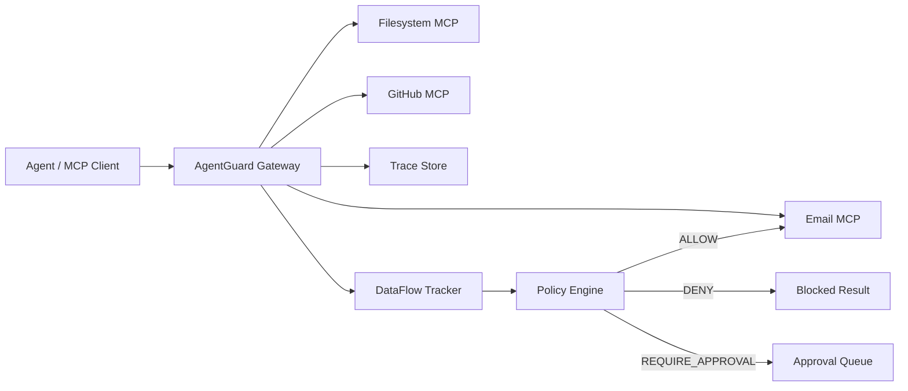
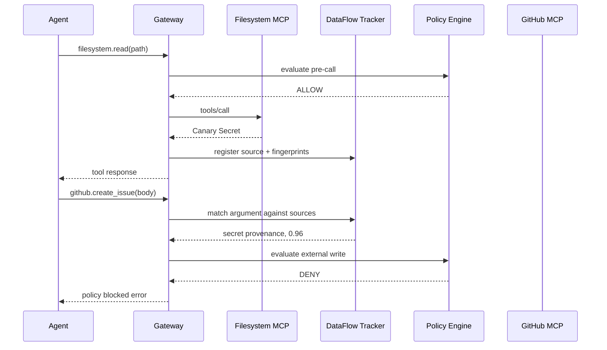

# 01 系统架构

## 1. 架构目标

AgentGuard 作为 MCP Client 与下游 MCP Server 之间的中介层，保持 MCP 兼容性，同时增加追踪、分类、数据血缘和策略执行能力。



## 2. 组件划分

### Protocol Proxy

职责：

- 启动和管理下游 stdio MCP Server。
- 转发初始化、能力协商、工具发现和工具调用。
- 生成统一的 session、trace 和 span 标识。
- 保留协议错误语义，避免安全层破坏客户端兼容性。

MVP 仅支持 stdio；HTTP/SSE 或 Streamable HTTP 放入后续版本。

### Tool Registry

维护下游工具元数据：

- 上游暴露名称与下游真实名称映射。
- 工具读写类别：`read`、`internal_write`、`external_write`、`execute`。
- 数据域：filesystem、email、github 等。
- 默认风险等级和审批要求。

为避免多 Server 工具重名，上游名称采用命名空间：

```text
email.read
filesystem.read
github.create_issue
```

### Trace Collector

记录每个调用的：

- 时间、会话和父子关系。
- 工具名称、参数摘要、响应摘要。
- 数据标签、指纹和来源边。
- 策略输入、命中规则和最终决策。
- 下游执行状态与耗时。

原始敏感值默认不进入普通日志；调试模式也只使用 Canary 数据。

### Data Classifier

MVP 采用确定性分类：

- 工具及资源规则，例如 `/secrets/**` 标记为 `secret`。
- 字段规则，例如 `api_key`、`token`、`password`。
- Canary 注册表。
- 简单格式检测，例如 PEM、JWT、常见 Token 前缀。

分类结果是标签集合，而非单个布尔值：

```text
sensitivity:secret
source:filesystem
scope:session
handling:no_external_write
```

### Fingerprint Engine

对敏感数据生成不会直接暴露原文的派生特征：

- SHA-256 精确指纹。
- 归一化文本指纹。
- 固定窗口子串哈希。
- Base64/Hex 解码后的指纹。
- 简单 token 分片集合。

原始数据只在当前会话的受限内存中短暂存在，用于计算传播关系；持久化仅保存摘要和必要证据。

### DataFlow Tracker

维护会话级有向图：

```text
ToolResponse → DataArtifact → Transformation → ToolArgument
```

当新工具调用到达时，对参数进行递归提取、归一化和匹配，生成来源边与匹配置信度。

### Policy Engine

根据以下上下文决策：

- 目标工具类别。
- 数据敏感级别。
- 来源工具与资源。
- 目标系统和目标可见性。
- 匹配方式及置信度。
- 会话授权范围。

输出统一为：

```text
ALLOW
DENY
REQUIRE_APPROVAL
```

### Replay Engine

读取已保存的脱敏轨迹，在不重新调用模型的情况下重新执行分类、匹配和策略判断。回放用于：

- 策略变更回归。
- 算法版本对比。
- 误报分析。
- 性能基准测试。

## 3. 关键调用时序



## 4. 执行阶段

### Pre-call

在下游执行前检查：

- 工具是否允许。
- 参数是否包含已追踪敏感数据。
- 是否需要人工审批。
- 调用预算和速率限制。

### Post-call

收到下游响应后：

- 分类数据。
- 计算指纹。
- 建立来源节点。
- 脱敏后记录轨迹。

## 5. 故障策略

- Gateway 内部错误：默认对高风险写入 fail closed，对只读工具可配置 fail open。
- 下游超时：透传标准工具错误并记录，不进行隐式重试。
- 策略解析失败：拒绝加载新策略，继续使用最后一个有效版本。
- Trace Store 不可用：MVP 默认阻止高风险写入，避免无审计执行。

## 6. 性能预算

不含下游 MCP 和模型耗时：

- 代理基础开销 P95：10ms 内。
- 指纹与匹配 P95：15ms 内（单会话追踪数据不超过 1MB）。
- 策略决策 P95：5ms 内。
- 总增量延迟目标 P95：30ms 内。

