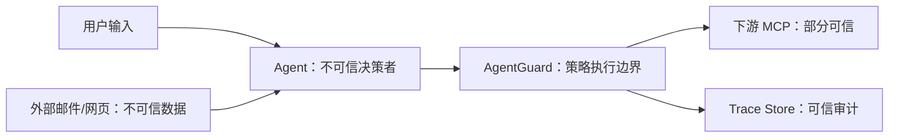

# 04 威胁模型

## 1. 保护目标

- 防止受追踪敏感数据通过 MCP 外部写工具泄漏。
- 防止 Agent 调用任务范围外的高风险工具。
- 保证策略决策和工具执行具有可审计性。
- 防止攻击者通过修改轨迹或审批结果掩盖行为。

## 2. 信任边界

### 不可信

- Agent 输出和工具调用意图。
- 邮件、网页、Issue、文档等外部内容。
- 未经审核的 MCP 工具描述和返回内容。

### 部分可信

- 下游 MCP Server：可能被入侵、误配置或返回恶意内容。
- 策略管理员：拥有高权限，需要审计变更。

### 可信计算基

- AgentGuard Gateway 进程。
- 已验证的策略版本。
- Trace Store 完整性机制。

## 3. 主要威胁

### T1 间接提示词注入

外部内容诱导 Agent 读取秘密并写入外部系统。

控制：外部内容不被视为策略依据；对实际工具数据流进行检测。

### T2 工具投毒

恶意 MCP 工具描述要求读取或提交额外数据。

控制：工具元数据扫描、命名空间隔离、工具权限清单；MVP 重点记录并限制实际调用。

### T3 跨工具数据泄漏

合法读取工具与合法写入工具组合形成泄漏链。

控制：会话级来源图、指纹匹配、Sink 策略。

### T4 数据变形规避

通过编码、插入空白、截断、拼接或分片规避检测。

控制：归一化、候选解码、子串指纹和跨字段组合匹配。

### T5 审批重放

攻击者复用旧审批批准不同参数。

控制：审批 Token 绑定调用和参数摘要，短时有效且一次性使用。

### T6 Gateway 绕过

Agent直接连接下游 Server。

控制：测试环境只向 Agent暴露 Gateway；生产部署需要网络、凭据或进程权限确保下游不可直达。

### T7 日志二次泄漏

安全系统自身记录敏感参数。

控制：原文仅内存短暂处理；持久化默认脱敏；日志测试加入 Canary 断言。

### T8 拒绝服务

超大工具响应或大量碎片导致指纹计算耗尽资源。

控制：单响应大小、会话追踪总量、解码次数和匹配时间预算。

### T9 策略降级

恶意或错误配置放宽策略。

控制：策略版本、静态验证、必需测试、变更审计和最后有效版本回退。

## 4. MVP 安全限制

- 全部使用合成 Canary，不使用真实密钥。
- GitHub、Email均为本地模拟写入。
- 下游进程在 Docker 或受限工作目录运行。
- 禁止任意 Shell 工具进入首版默认 Tool Registry。
- 响应大小上限建议 1MB，会话追踪总量建议 10MB。

## 5. 已知不足

- 不能可靠检测完全语义化改写后的秘密。
- 加密后的数据在没有密钥的情况下无法恢复来源。
- 未经过 Gateway 的通道不可见。
- 指纹和相似匹配可能对短字符串产生误报。
- 工具返回的结构化对象需要按字段敏感度优化。

这些不足必须在 README 和演示中明确说明。

## 6. 安全验收

- Canary 不得出现在普通日志、错误栈和前端接口响应中。
- 被 `DENY` 的调用不得到达下游模拟 Server。
- 审批参数发生变化时必须重新审批。
- Gateway重启后不能默认为允许高风险写入。
- 策略无效时不得加载。

