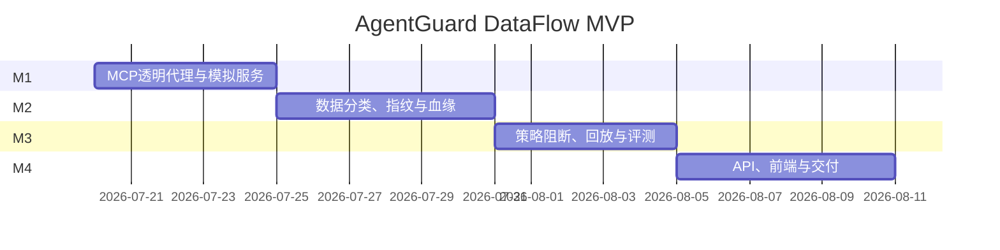

# 07 实施计划

> 当前实际进度见 [开发状态](08-development-status.md)。

## 1. 总体计划

建议按 4 个里程碑、约 4 周完成一个可公开演示的 MVP。每个里程碑都必须形成可运行纵向切片。



日期仅作为排期参考，以实际开工日顺延。

## 2. M1：透明代理与安全演示骨架

目标：打通 `Agent → Gateway → Mock MCP`，完整记录工具调用。

### 任务

| ID | 任务 | 输出 | 依赖 |
|---|---|---|---|
| M1-01 | 初始化 Python 项目与质量工具 | pyproject、lint、typecheck、pytest | 无 |
| M1-02 | 定义核心 Pydantic 模型 | Session、ToolCall、Event | M1-01 |
| M1-03 | 实现 stdio MCP 下游进程管理 | Server lifecycle | M1-01 |
| M1-04 | 实现工具发现与命名空间映射 | Tool Registry | M1-03 |
| M1-05 | 实现 tools/call 透明转发 | Protocol Proxy | M1-03 |
| M1-06 | 创建 Email、Filesystem、GitHub 模拟 MCP | 3 个本地 Server | M1-01 |
| M1-07 | 实现 JSONL Trace Collector | 可查看调用轨迹 | M1-02 |
| M1-08 | 创建最小 Target Agent 和正常任务 | 端到端 Demo | M1-04～07 |

### 验收

```text
email.read → filesystem.read → github.create_issue
```

三次调用都经过 Gateway，Trace 中包含请求、响应、耗时和上下游工具映射。

## 3. M2：数据分类与血缘追踪

目标：识别敏感工具响应，并在后续调用参数中恢复传播关系。

### 任务

| ID | 任务 | 输出 | 依赖 |
|---|---|---|---|
| M2-01 | Canary Registry | 注册与查询合成秘密 | M1 |
| M2-02 | Data Classifier | 路径、字段、格式标签 | M2-01 |
| M2-03 | Fingerprint Engine | 精确与归一化指纹 | M2-01 |
| M2-04 | Base64/Hex 候选解码 | 编码泄漏检测 | M2-03 |
| M2-05 | 子串窗口指纹 | 部分泄漏检测 | M2-03 |
| M2-06 | 参数递归展开 | JSONPath 标量字段 | M1 |
| M2-07 | Session DataFlow Graph | Artifact 与 Edge | M2-02～06 |
| M2-08 | 数据脱敏与内存清理 | 安全存储边界 | M2-07 |

### 验收

- 文件读取产生 `sensitivity:secret` Artifact。
- GitHub参数出现原文或 Base64 变形时产生 ProvenanceEdge。
- 持久化轨迹中不出现 Canary 原文。

## 4. M3：策略阻断、回放和 Benchmark

目标：在外部写入前阻断泄漏，并形成可复现实验。

### 任务

| ID | 任务 | 输出 | 依赖 |
|---|---|---|---|
| M3-01 | YAML策略 Schema 与加载器 | 可验证策略文件 | M2 |
| M3-02 | 条件求值与优先级 | Policy Engine | M3-01 |
| M3-03 | Pre-call 执行与 DENY | 写入前阻断 | M3-02 |
| M3-04 | REQUIRE_APPROVAL 状态机 | 本地审批 API | M3-03 |
| M3-05 | Replay Engine | 无下游副作用回放 | M2、M3-02 |
| M3-06 | 场景 YAML 与 Runner | 固定攻击集 | M2 |
| M3-07 | Benchmark Metrics | 检出率、误报率、延迟 | M3-05～06 |
| M3-08 | JSON/Markdown 报告 | 可公开评测结果 | M3-07 |

### 验收

- Baseline 可复现 Canary 外传。
- Protected 模式阻止写入，下游 GitHub Mock 零调用。
- 正常 Issue 创建成功。
- 同一 Trace 在两个策略版本下可回放并比较决策。

## 5. M4：API、前端与项目交付

目标：完成原型中的数据血缘工作台和一键演示。

### 任务

| ID | 任务 | 输出 | 依赖 |
|---|---|---|---|
| M4-01 | FastAPI 查询接口 | Trace、Lineage、Policy API | M3 |
| M4-02 | React工程与设计系统 | 页面框架 | 无 |
| M4-03 | 流量总览 | 指标和事件列表 | M4-01～02 |
| M4-04 | React Flow血缘图 | Source→Sink 可视化 | M4-01～02 |
| M4-05 | 阻断详情与工具时间线 | 证据展示 | M4-04 |
| M4-06 | 策略和回放页面 | 策略版本对比 | M4-01～02 |
| M4-07 | Benchmark页面 | 指标和报告下载 | M4-01～02 |
| M4-08 | Docker Compose | 一键启动 | 全部 |
| M4-09 | README与3分钟演示脚本 | 公开交付 | 全部 |

### 验收

- 从攻击场景启动到前端展示阻断结果不超过 1 分钟。
- 原型中的来源、变形、Sink和DENY证据均来自真实后端数据。
- 新环境按 README 可在 10 分钟内启动。

## 6. 第一阶段具体开发顺序

首轮编码建议严格按以下顺序：

1. 创建仓库和 `pyproject.toml`。
2. 实现三个 Mock MCP Server。
3. 实现最小 stdio 透明转发。
4. 保存工具调用 JSONL。
5. 运行正常场景。
6. 加入 Canary 恶意场景，复现无防护泄漏。
7. 加入精确指纹和第一条 `DENY` 策略。
8. 为正常与恶意场景编写 pytest。

第一轮完成定义：

```text
baseline: Canary 到达 GitHub Mock
protected: Canary 被 Gateway 阻止
normal: 正常 Issue 创建成功
```

## 7. 风险与缓解

| 风险 | 影响 | 缓解 |
|---|---|---|
| MCP SDK或协议变化 | 代理兼容性 | 锁定版本，增加协议契约测试 |
| 短秘密误报 | 正常任务受阻 | 最小长度、置信度和审批区间 |
| 变形组合爆炸 | 延迟过高 | 解码预算、窗口限制、会话上限 |
| 日志泄漏 | 安全系统自身暴露秘密 | 默认脱敏、Canary日志测试 |
| 前端先于数据模型开发 | 返工 | API Schema稳定后再接真实页面 |
| 真实模型不稳定 | Demo波动 | 固定轨迹回放作为确定性演示 |

## 8. Definition of Done

每个任务完成必须满足：

- 有单元或集成测试。
- 类型检查通过。
- 敏感数据不进入普通日志。
- 新增公共对象包含 Schema 版本。
- 文档或示例同步更新。
- 关键决策有可审计理由。

## 9. 暂缓项

MVP 后再评估：

- HTTP/Streamable HTTP MCP。
- 多租户和远程身份认证。
- OPA/Rego。
- LLM语义泄漏检测。
- 企业 SIEM 集成。
- 真正的 GitHub、Email和数据库连接器。
- 跨会话长期数据血缘。
